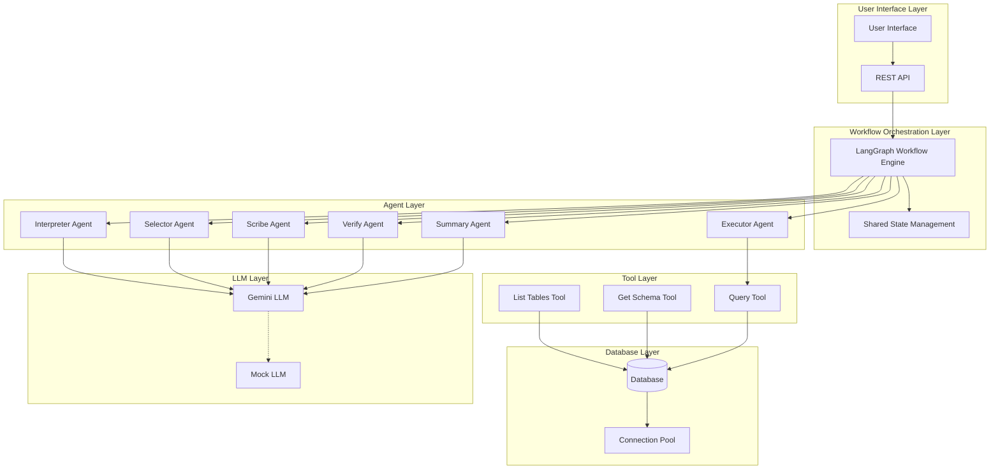
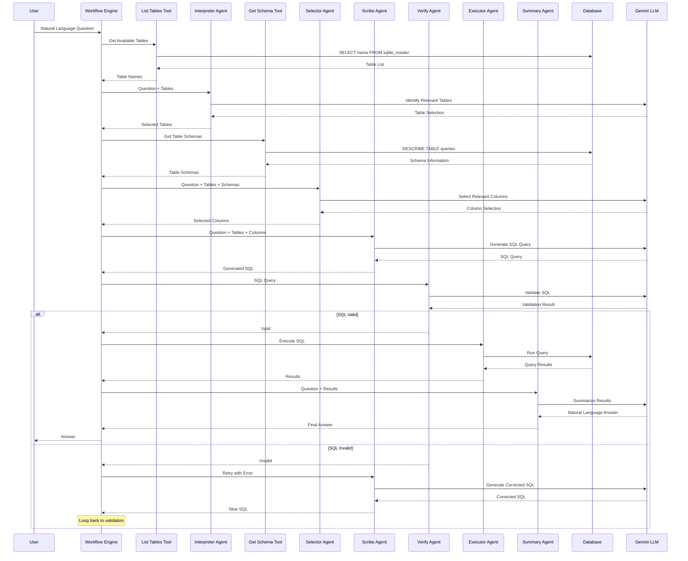
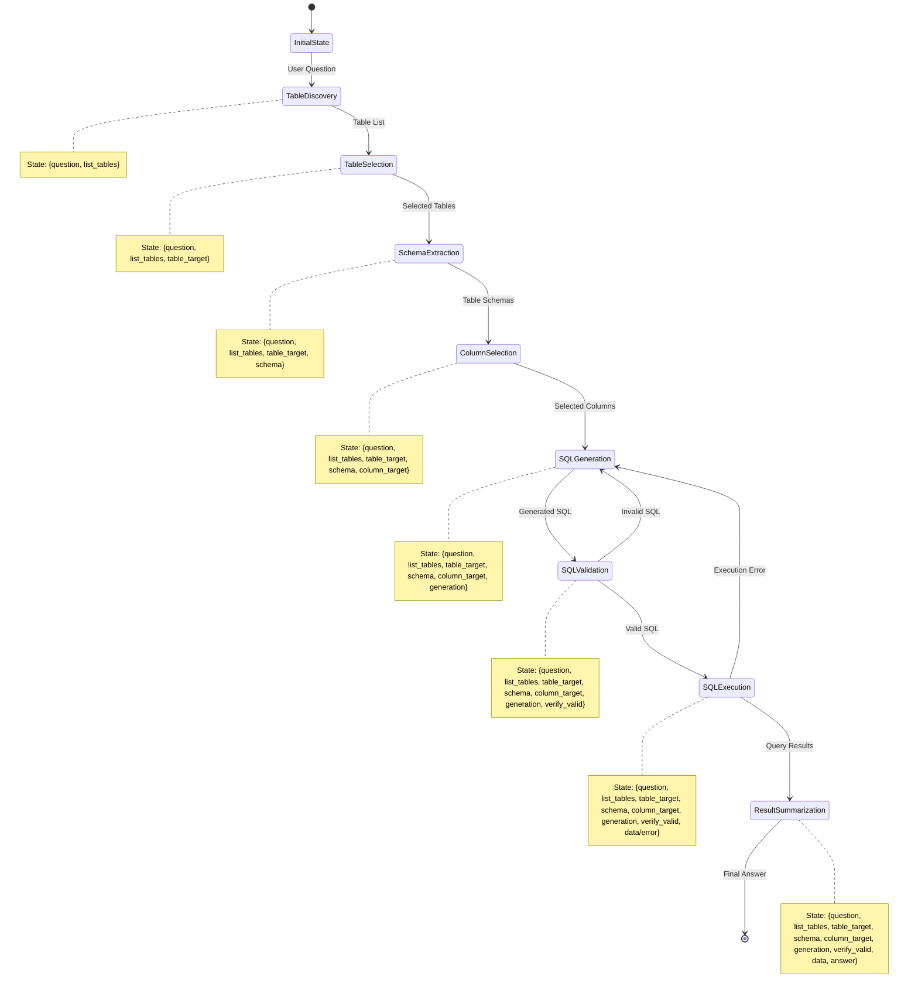
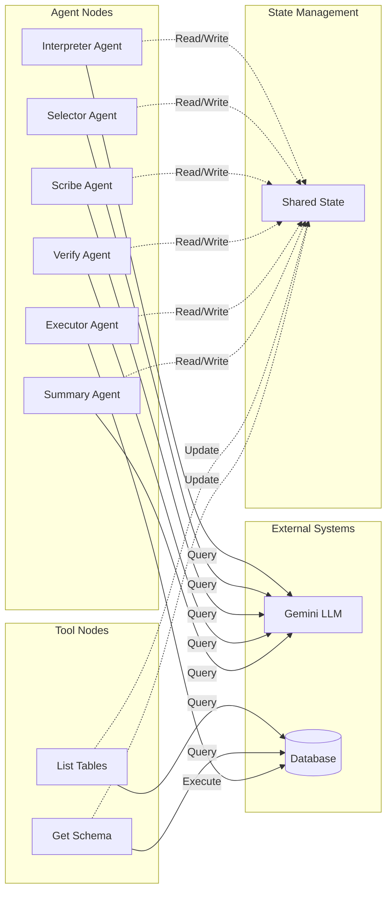
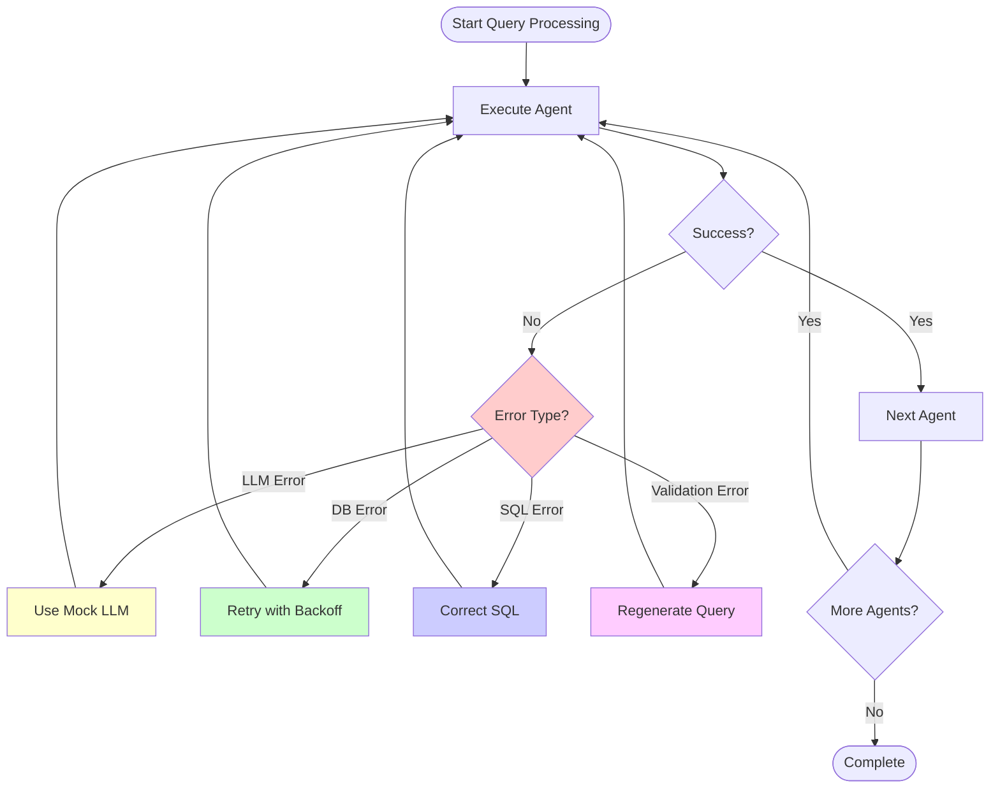
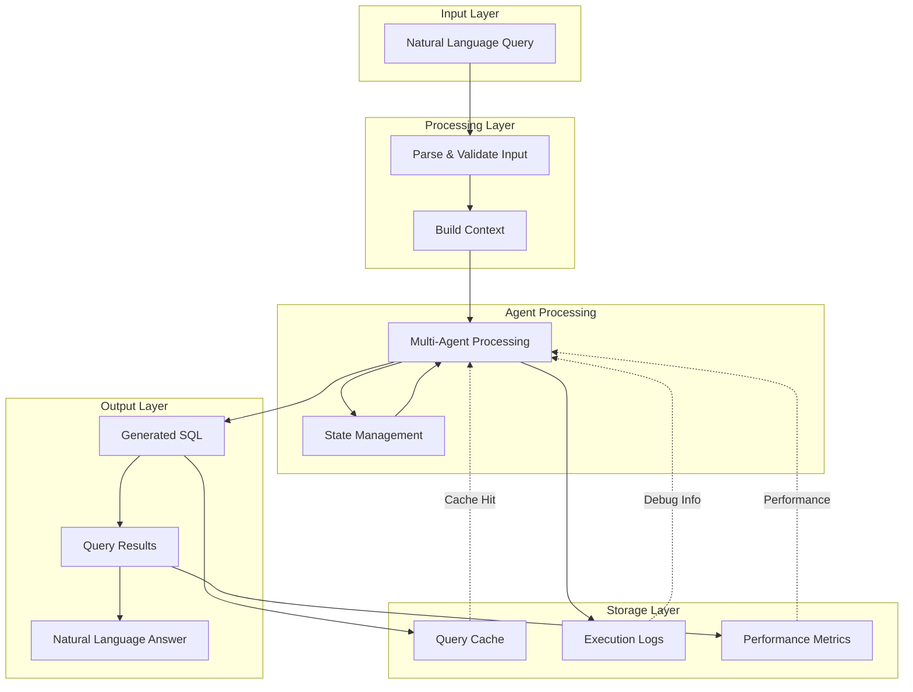
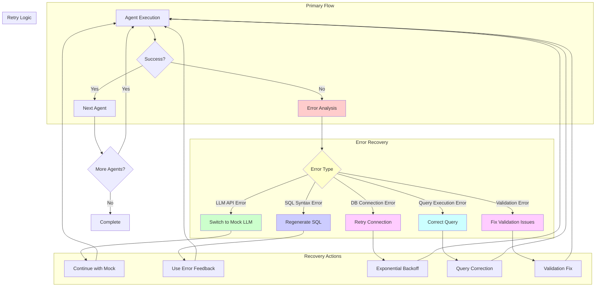
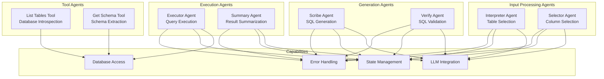

# 🏗️ Agentic Text-to-SQL Architecture Diagrams

## 📊 System Architecture Overview

## 🔄 Agent Workflow Sequence

## 🧠 Agent State Flow

## 🔧 Component Interaction Diagram

## 🛠️ Error Handling Flow

## 📊 Data Flow Architecture

## 🔄 Retry and Recovery Mechanisms

## 🎯 Agent Specialization Matrix

This comprehensive set of diagrams illustrates the complete agentic architecture, showing how different components interact, how data flows through the system, and how errors are handled and recovered from.
